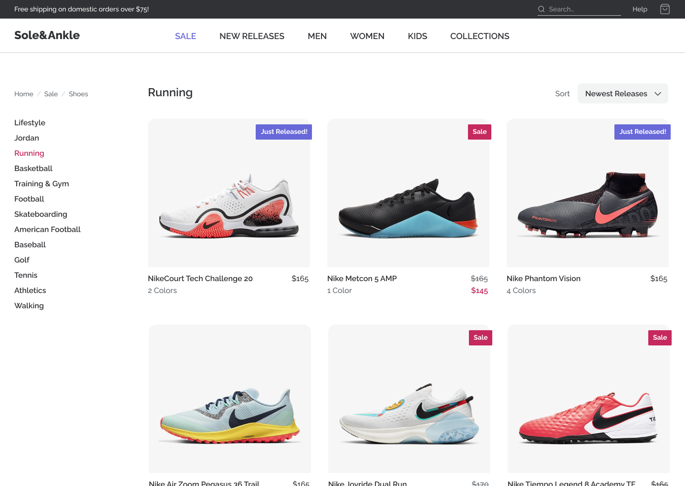
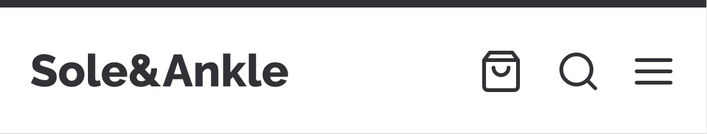
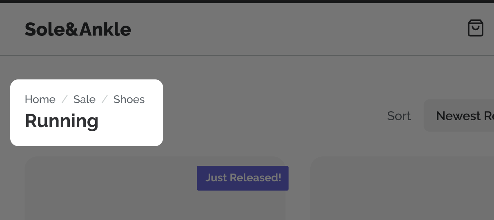
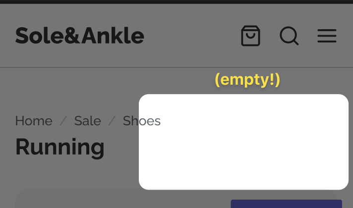
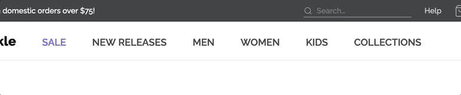
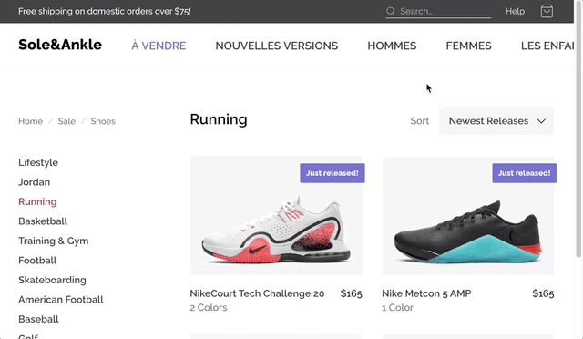

# Sole&Ankle, Revisited — Module 5 workshop

In the Flexbox module, we built an e-commerce store:



In this workshop, we'll make this application responsive, so that it looks great and works well on phones and tablets:


The design can be found on Figma:

- https://www.figma.com/file/kAL3AumTUV11y1IqHhltB6/Sole-and-Ankle-%E2%80%94-Mockup

We'll use a **desktop-first** approach for this process, and our breakpoints will be set as follows:

| Name   | Width (px) | Width (rem) |
| ------ | ---------- | ----------- |
| phone  | 600        | 37.5        |
| tablet | 950        | 59.375      |
| laptop | 1300       | 81.25       |

## Troubleshooting

If you run into problems running a local development server, check out our [Troubleshooting Guide](https://courses.joshwcomeau.com/troubleshooting) on the course platform.

This guide addresses the common `Digital Envelope Routine` error you may have seen.

---

## Exercise 1: Set up our breakpoints

Before we start tweaking the UI, let's add some structure to make it easy for us to use media queries.

It's up to you how you'd like to structure it! You can use the strategy discussed in [the “breakpoints” lesson](https://courses.joshwcomeau.com/css-for-js/05-responsive-css/07-breakpoints#managing-breakpoints), or you can use [styled-components' “theming” feature](https://styled-components.com/docs/advanced#theming).

Whichever approach you choose, your breakpoints should be specified in rems (not pixels).

## Exercise 2: Mobile header

On smaller screens, we want to switch up our header:



Our `SuperHeader` is removed, replaced with a decorative dark-gray line. The `Header`'s navigation is replaced by 3 icon buttons.

On mobile, a lot of the spacing gets tightened up.

**Be sure to check your work on a real mobile device.** You can use ngrok, as described in [the “Mobile Testing” lesson](https://courses.joshwcomeau.com/css-for-js/05-responsive-css/03-mobile-testing).

## Exercise 3: Tweaks to our main view

On portrait tablet, our left-hand column disappears.

The categories are really more of a nice-to-have, so they're removed. The breadcrumbs, though, are important for navigation, so they move to sit just above the category heading:



On mobile, we lose the "Sort" filter as well:



## Exercise 4: Mobile menu

Alright, let's implement the hamburger menu!

For convenience, a new component has been created for you, `MobileMenu`. It's not really a modal yet, though. Your job is to make it look _and_ act like a modal.

You'll need to update the hamburger-menu button we added in Exercise 2 to flip `showMobileMenu` to `true`.

You should use the `@reach/dialog` package to make sure that the modal is accessible. We took a quick look at this package in a bonus video, [“Building accessible modals”](https://courses.joshwcomeau.com/css-for-js/05-responsive-css/05-exercises#bonus-building-accessible-modals). You can check out the docs for more details:

- https://reach.tech/dialog/

(You may wish to skip the default styles that come with the package. This is explained in [their styling guide](https://reach.tech/styling/#skip-including-styles). The `--reach-dialog` flag has already been set for you, in `GlobalStyles.js`)

## Exercise 5: Fluid desktop navigation

As it stands, our desktop navigation disappears _just_ before it runs out of space:



What happens, though, if our Marketing friends rename the categories? Or, what happens when we internationalize the project, and the category names are rendered in a longer language?



We can do two things to make this better:

1. Manage the overflow in the header to scroll this section when it doesn't fit.
2. Use fluid gaps between the nav links, to reduce the likelihood that this'll be required.

Here's our goal:


**NOTE:** Your solution doesn't have to match this GIF _exactly_. Don't worry about picking the perfect numbers! You can use the [“Fluid Calculator” tool](https://courses.joshwcomeau.com/css-for-js/05-responsive-css/16-fluid-calculator) to get close enough

## Exercise 6: Theming with CSS Variables

As it stands, we have a few colors in our `constants.js` file. When we want to use a color, we import and interpolate it:

```jsx
import { COLORS } from '../../constants';

const Something = styled.p`
  color: ${COLORS.gray[900]};
`;
```

This works fine, but I personally prefer to use CSS variables for colors. It makes it a bit easier to write:

```jsx
const Something = styled.p`
  color: var(--color-gray-900);
`;
```

In this exercise, your goal is to update the project to use CSS variables for colors, and optionally font-weights.

**BONUS:** The modal backdrop should use a CSS variable that is created using fragments from the main colors.
